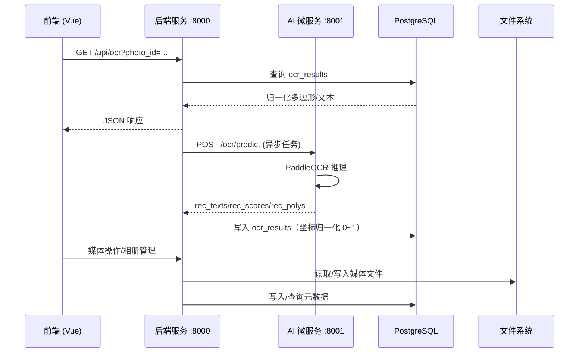

# 架构设计文档

::: code-group

```python [Python]
console.log('js 代码')
```

```sh [pnpm]
console.log('ts 代码')
```

```vue
<template></template>
```

:::

## 1. 整体架构图

TrailSnap 采用典型的前后端分离架构，由前端展示层、后端服务层、AI 微服务层和数据存储层组成。


1. **前端展示层**：通过 Nginx 反向代理统一入口，支持 HTTP/HTTPS 访问，为用户提供前端交互界面。
2. **后端服务层**：以 FastAPI 为核心，通过安全认证模块实现 JWT 身份鉴权与多用户权限隔离，保障家庭多用户使用安全；拆分业务逻辑服务与任务管理器，实现同步业务与异步 AI 任务的解耦；通过 SQLAlchemy ORM 对接 PostgreSQL 存储元数据，通过文件服务对接 NAS 本地文件系统存储图片，完全适配 NAS 存储架构。
3. **AI 微服务层**：采用统一入口调度，内置模型管理器，实现模型按需懒加载、空闲自动卸载、按需自动下载的智能生命周期管理，大幅降低 NAS 内存与算力占用；集成 PaddleOCR、InsightFace、YOLO+OCR、CLIP 等 AI 能力，覆盖 OCR 识别、人脸识别、票据识别、向量检索等核心相册功能，同时支持对接 Qwen、GPT 等外部大模型，具备良好扩展性。
4. **数据存储层**：元数据与文件分离存储，数据完全本地化，保障家庭数据隐私安全。

## 2. 技术选型及版本

### 2.1 前端技术栈

### 2.2 后端技术栈
- **编程语言**: Python 3.12+
- **Web 框架**: FastAPI 0.122.0
- **ASGI 服务器**: Uvicorn 0.38.0
- **ORM**: SQLAlchemy 2.0.44
- **数据库迁移**: Alembic 1.17.2
- **数据库驱动**: psycopg2 (PostgreSQL)
- **任务/异步**: APScheduler、`aiohttp`
- **AI/CV (AI 微服务)**:
  - PaddleOCR ==3.3.2
  - PaddlePaddle-GPU `==3.2.0`（可选 GPU）
  - OpenCV `opencv-python-headless >=4.9.0`
  - Torch `>=2.0.0`、TorchVision `>=0.15.0`（部分模型可用）
  - InsightFace（人脸）
- **日志**: 自定义 JSON 队列日志 + 按日容量滚动（server 与 ai 均内置）

### 2.3 数据库
- **PostgreSQL(PgVector)**: 关系型数据库，存储用户、相册、照片元数据、系统设置等。

## 3. 目录结构与模块说明

### 3.1 根目录
- `package/server`: 后端服务代码
- `package/website`: 前端应用代码
- `doc`: 项目文档

### 3.2 后端结构 (`package/server`)
- **app/**: 核心应用代码
  - `api/`: API 路由定义 (EndPoints)，按功能模块划分 (user, album, photo, etc.)
  - `core/`: 核心配置与工具 (Logger, Config)
  - `crud/`: 数据库 CRUD 操作封装
  - `db/`: 数据库模型 (Models) 与会话管理 (Session)
  - `schemas/`: Pydantic 数据模型 (Request/Response schemas)
  - `service/`: 复杂业务逻辑与后台服务 (TaskManager, Indexer, Storage)
  - `utils/`: 通用工具函数 (Exif解析, 文件名处理)
- **railway/**: 铁路相关功能模块 (独立的数据处理与同步逻辑)
- **yolo_ocr/**: OCR 与票据识别相关模型与脚本
- **main.py**: 应用入口，路由挂载、CORS、中间件与端口配置（默认 `:8000`）

### 3.3 前端结构 (`package/website`)
- **src/**: 源代码
  - `api/`: 后端接口封装
  - `assets/`: 静态资源 (图片, CSS)
  - `components/`: 通用 Vue 组件 (PhotoGallery, TrainTicket, etc.)
  - `composables/`: 组合式函数 (Hooks)
  - `layouts/`: 页面布局组件
  - `router/`: 路由配置
  - `stores/`: Pinia 状态管理仓库
  - `types/`: TypeScript 类型定义
  - `views/`: 页面视图 (Pages)
  - `package.json`: 依赖与版本管理，内含脚本 `dev/build/preview`

### 3.4 AI 微服务结构 (`package/ai`)
- **app/main.py**: AI 服务入口（默认 `:8001`），挂载 `ocr/face/object-detection/tickets` 路由
- **app/services/**: 模型服务（`ocr_service.py`、`face_service.py`、`model_manager.py` 懒加载与资源释放）
- **app/core/logger.py**: JSON 队列日志，按日容量滚动
- **requirements.txt**: 依赖与版本约束（PaddleOCR、PaddlePaddle-GPU、Torch、OpenCV 等）

## 4. 关键交互与调用链


