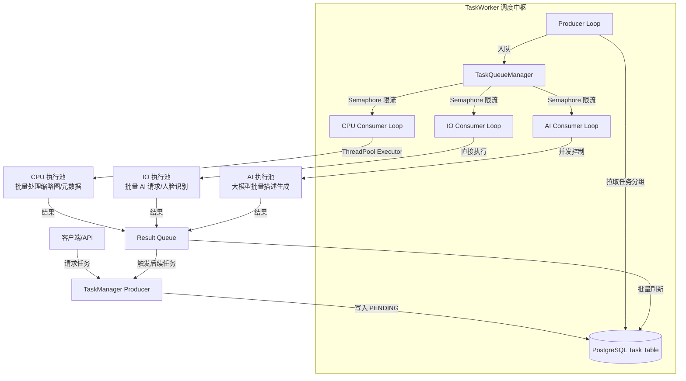

# 任务管理模块设计文档

## 1. 整体架构

任务管理模块采用**多级缓冲 + 生产者-消费者（Multi-Level Buffer + Producer-Consumer）**模型，以**数据库（PostgreSQL）作为持久化后端，以内存优先级队列作为调度中枢**，实现了任务生产与消费的彻底解耦。该架构主要包含以下四个核心组件：

- **生产者 (TaskManager)**: 运行在 API 服务进程中，负责接收用户请求或系统触发的事件，生成任务并写入数据库。
- **持久化任务队列 (Database Table)**: `Task` 表充当可靠的任务持久化存储，存储任务的类型、状态、优先级、负载参数等信息，确保在服务重启时任务不丢失。
- **调度中枢 (TaskQueueManager)**: 位于 `task_worker.py` 中的内存调度模块，维护三个独立优先队列（CPU / IO / AI），负责从数据库批量拉取任务并进行优先级排序。
- **消费者 (TaskWorker)**: 三个独立的工作协程（CPU Consumer、IO Consumer、AI Consumer），分别监听对应分类队列，以**自适应速率**消费任务并通过执行池完成处理。

### 架构图示



## 2. 核心设计思想

### 2.1 策略模式与工厂模式（Strategy + Factory Pattern）

任务执行层彻底采用了**策略模式**进行解耦：

- **BaseTaskStrategy**（抽象基类）：定义了所有任务处理器必须实现的接口，包括 `process()`（单任务处理）和 `process_batch()`（批量处理），以及 `handle_completion()`（完成回调）。
- **TaskStrategyFactory**（策略工厂）：通过类方法注册机制（`@TaskStrategyFactory.register(TaskType.XXX)`），维护了一个从 `TaskType` 到具体策略类的映射表。调度层完全不依赖具体任务类型，仅通过工厂动态获取策略实例，实现了**开闭原则（OCP）**——新增任务类型无需修改调度核心代码。

### 2.2 反馈驱动的自适应生产速度

传统轮询模型的通病是**无意义的数据库 I/O**：无论队列是否积压，都按固定频率拉取数据。

本系统实现了**队列深度反馈驱动**的生产逻辑：

- `TaskQueueManager` 实时暴露三个队列的 `qsize()`。
- 生产者每次循环时，先检查各队列长度是否低于阈值（`QUEUE_THRESHOLD = 50`）。
- **仅当队列空闲且低于阈值时，才从数据库拉取任务**。消费快则补充快，消费慢甚至停止生产，真正实现了"以消费拉动生产"的节能高效模式。

### 2.3 多级缓冲与批量处理（Multi-Level Batching）

为最大化处理效率，系统实现了**三级批量处理**：

1. **数据库级批量拉取**：每次查询最多从数据库提取 150 条 PENDING 任务。
2. **分组级批量打包**：将这 150 条任务按 `TaskType` 分组，同类型任务打包为 1 个"原始批次"。
3. **执行级批量切分**：原始批次在推入内存队列前，会被切分为**每批最多 8 个子任务**的标准化 Batch。

这种设计既保证了数据库 I/O 的低频性（一次取一大把），又确保了内存中每个任务对象的轻量性，以及 AI 微服务批量接口的最大利用率（每批 8 张图是 AI 服务的最佳性价比点）。

### 2.4 优先级优先队列（Priority Queue Scheduling）

`TaskQueueManager` 内部使用 `asyncio.PriorityQueue` 作为各分类队列的实现：

```python
# 入队元素结构：(负优先级, 计数器, Batch列表)
await queue.put((-priority, count, batch))
```

- **优先级取反**：因为 Python 的小根堆默认数值越小越先出，故取反使得**高数值优先级反而先被消费**。
- **计数器打破僵局**：当两个 Batch 优先级相同时，用自增计数器区分，避免直接比较字典导致的 `TypeError`。

## 3. 生产者与消费者协同机制

### 生产者 (TaskManager)

- **入口**: `package/server/app/service/task_manager.py`
- **职责**: 接收业务逻辑的任务创建请求，根据任务类型分配默认优先级，支持批量添加任务到数据库，状态初始化为 `PENDING`。

### 调度中枢 (TaskQueueManager)

- **入口**: `package/server/app/service/task_worker.py` 内部类
- **职责**:
  - `_fetch_tasks_to_queues_sync`：从数据库批量拉取 PENDING 任务，按 TaskType 分组并切分为标准 Batch（每批 ≤ 8），以任务中第一个元素的优先级作为整批的优先级，推入对应的内存分类队列。
  - 三个 `consumer_loop`：独立协程，分别从 CPU / IO / AI 队列中按优先级顺序取出 Batch 执行。
  - `execute_batch_task_wrapper`：根据任务类型从工厂获取策略实例，调用 `process_batch()` 并处理超时与异常。

### 消费者并发控制

每个消费者协程内部维护一个 `asyncio.Semaphore` 来实现**细粒度并发控制**：

| 队列类型 | 最大并发数 | 适用场景 |
|---------|-----------|---------|
| CPU     | `os.cpu_count() 或 4` | 缩略图生成、元数据提取 |
| IO      | `10` | 人脸识别、OCR、图像分类、向量嵌入 |
| AI      | `2` | 视觉描述生成（依赖大模型，资源稀缺） |

消费者必须先获取信号量许可，才能从队列取出 Batch——这保证了即使数据库一次性拉取了大量任务，内存中也不会因为无限制并发导致资源耗尽。

## 4. 任务策略体系

所有具体任务处理器均继承自 `BaseTaskStrategy`，通过 `@TaskStrategyFactory.register(TaskType.XXX)` 注册。

### 4.1 策略基类接口

```python
class BaseTaskStrategy(ABC):
    @property
    @abstractmethod
    def task_category(self) -> str:  # 返回 'CPU' | 'IO' | 'AI'
        pass

    @abstractmethod
    async def process(self, worker, task: Task, db: Session) -> Any:
        pass  # 单任务处理（兼容旧接口）

    async def process_batch(self, worker, tasks: List[Task], db: Session) -> List[Dict]:
        # 默认实现：循环调用 process()，子类可覆盖以实现真正的批量处理
        results = []
        for task in tasks:
            res = await self.process(worker, task, db)
            results.append({...})
        return results

    async def handle_completion(self, worker, items: List[Dict], db: Session) -> None:
        # 任务完成后的回调，用于触发后续任务链（如 PROCESS_BASIC 完成后触发元数据提取）
        pass
```

### 4.2 典型策略实现

#### BasicTaskStrategy（CPU 批量处理）

CPU 任务（如缩略图生成）存在大量同步阻塞 I/O（文件读写）和 CPU 计算（OpenCV）。

**优化措施**：实现 `process_basic_cpu_batch_job`，在**单次线程池调用**中顺序处理 8 个子任务：

```python
def process_basic_cpu_batch_job(tasks_data: List[Dict]) -> List[Dict]:
    results = []
    for data in tasks_data:
        res = process_basic_cpu_job(data['file_path'], data['file_id'], ...)
        results.append(res)
    return results
```

这样，8 张图片的缩略图生成**共享同一次线程池上下文切换开销**，极大提升了 CPU 密集型任务的吞吐量。

#### AI/IO 策略（网络批量请求）

对于依赖外部 AI 微服务的任务（如 `face.py`、`ocr.py`），`process_batch` 会将 8 张图片的 Base64 编码合并为**单次 HTTP 请求**：

```python
async def process_batch(self, worker, tasks, db):
    b64_images = [read_image_base64(p) for p in valid_photos]
    async with aiohttp.ClientSession() as session:
        async with session.post(api_url, json={"images": b64_images}) as resp:
            results = (await resp.json())['results']
    # 批量解析返回结果，批量更新数据库
```

这种方式将 8 次网络往返缩减为 1 次，显著降低了网络延迟对整体吞吐的影响。

## 5. 任务优先级实现

任务优先级通过 `Task` 表中的 `priority` 字段（整数）实现，数值越大优先级越高。

- **默认优先级**: 系统定义了 `DEFAULT_PRIORITIES` 字典，自动为不同类型的任务分配优先级。
  - `SCAN_FOLDER` (10): 最高优先级，用户感知的扫描操作。
  - `PROCESS_BASIC` (9): 基础处理，影响后续所有 AI 任务。
  - `GENERATE_THUMBNAIL` (8): 缩略图生成，影响前端展示。
  - `EXTRACT_METADATA` (5): 元数据提取。
  - `RECOGNIZE_FACE` / `OCR` (1): 后台 AI 分析，低优先级。
- **调度逻辑**: 消费者从内存队列取任务时，PriorityQueue 自动保证高优先级 Batch 优先被消费。

## 6. 任务状态管理

任务在其生命周期中会在以下状态间流转（定义在 `TaskStatus` 枚举中）：

1. **PENDING**: 初始状态，任务已创建但未被执行。
2. **PROCESSING**: 正在执行中。Worker 从数据库取出任务后立即设置此状态。
3. **COMPLETED**: 执行成功。通常在完成后会从数据库中删除记录，以保持表轻量。
4. **FAILED**: 执行出错。记录保留在数据库中，并附带错误信息供排查。

**启动恢复机制**：
服务启动时，`TaskWorker` 会执行 `_recover_unfinished_tasks`，将所有处于 `PROCESSING` 状态的任务重置为 `PENDING`，确保服务意外崩溃后任务不丢失。

## 7. 异常处理与超时控制

### 超时机制

每个 Batch 执行都包裹在 `asyncio.wait_for` 中：

- AI 任务（依赖大模型响应）：**120 秒**超时上限。
- CPU / IO 任务：**300 秒**超时上限。

超时后，Batch 内所有子任务会被批量标记为 `FAILED`，并附带超时错误信息，防止单个慢任务永久占用并发配额导致系统瘫痪。

### 异常处理层次

1. **Batch 级捕获**：在 `execute_batch_task_wrapper` 中统一拦截，写入 `result_queue`。
2. **策略级容错**：每个策略的 `process_batch` 内部自行处理业务异常（如文件不存在、分辨率过滤），返回结构化的失败结果。
3. **进程级容错**：Worker 主循环包含宽泛的 `try-except` 块，配合 `asyncio.CancelledError` 优雅退出，确保单个任务或策略的严重错误不会导致整个 Worker 崩溃。

## 8. 资源管理与生命周期

### 执行池动态管理

- **进程池（ProcessPoolExecutor）**：用于 CPU 密集型任务，冷启动成本高，空闲 **300 秒**后才关闭。
- **线程池（ThreadPoolExecutor）**：用于 IO 密集型任务和 CPU 任务的批量包装执行，空闲 **300 秒**后关闭。
- **AI 消费者并发限制**：通过 `asyncio.Semaphore(2)` 严格控制同时进行的大模型请求数量，防止压垮外部 AI 服务。

### 空闲退避策略（Exponential Backoff）

当队列完全空闲时，Producer 循环采用**指数退避**策略休眠：

```python
backoff_delay = min(1.0 * (1.5 ** retries), 10.0)  # 1s → 1.5s → 2.25s → ... → 10s 上限
```

空闲超过 **5 分钟**时，Worker 自动退出以释放所有资源，待下次有任务时由外部监控重启。

## 9. 性能优化策略总结

| 优化手段 | 描述 | 效果 |
|---------|------|------|
| **多级缓冲架构** | 数据库 → 内存队列 → 执行池 | 读写分离，数据库 I/O 降低 90%+ |
| **自适应生产速度** | 队列深度反馈驱动拉取 | 消除空轮询，CPU 占用接近零 |
| ** PriorityQueue 调度** | 高优先级任务优先消费 | 关键任务零延迟响应 |
| **批量打包（8/Batch）** | AI 微服务批量接口 | 网络往返次数降至 1/8 |
| **CPU 批量线程处理** | 单线程顺序处理 8 张图片 | 线程切换开销降低 87.5% |
| **asyncio.Semaphore 限流** | 消费者协程级并发控制 | 内存中无无限并发风险 |
| **asyncio.wait_for 超时** | Batch 执行超时兜底 | 单慢任务无法瘫痪整个系统 |
| **指数退避 + 自动退出** | 空闲时节能降耗 | 5 分钟无任务即释放所有资源 |
| **完成即删除** | 成功任务从数据库清除 | Task 表保持轻量，查询不退化 |

## 10. 扩展指南

### 新增任务类型

1. 在 `app/db/models/task.py` 的 `TaskType` 枚举中添加新类型。
2. 创建新的策略类，继承 `BaseTaskStrategy`，实现 `process()` 或 `process_batch()` 方法。
3. 使用 `@TaskStrategyFactory.register(TaskType.NEW_TYPE)` 注册。
4. 在 `task_manager.py` 的 `DEFAULT_PRIORITIES` 中添加默认优先级。

**无需修改 TaskWorker 核心代码**，即可完成新任务类型的接入。
