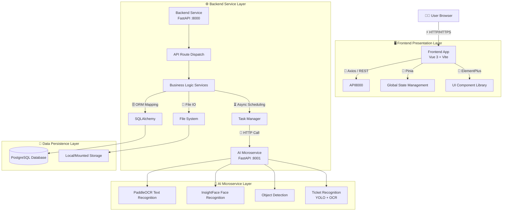
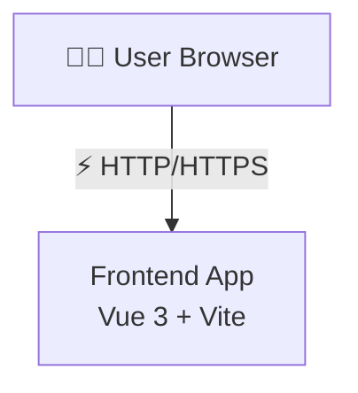
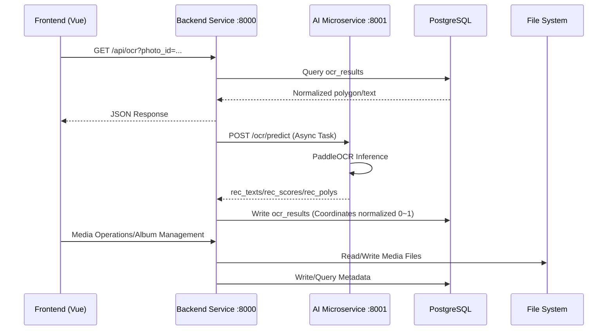

# Architecture Design Document

## 1. Overall Architecture Diagram

TrailSnap adopts a typical separated frontend and backend architecture, consisting of a frontend presentation layer, a backend service layer, and a data storage layer.

## 2. Technology Stack & Versions

### 2.1 Frontend Stack

### 2.2 Backend Stack
- **Programming Language**: Python 3.12+
- **Web Framework**: FastAPI 0.122.0
- **ASGI Server**: Uvicorn 0.38.0
- **ORM**: SQLAlchemy 2.0.44
- **Database Migration**: Alembic 1.17.2
- **Database Driver**: psycopg2 (PostgreSQL)
- **Task/Async**: APScheduler, `aiohttp`
- **AI/CV (AI Microservice)**:
  - PaddleOCR ==3.3.2
  - PaddlePaddle-GPU `==3.2.0` (Optional GPU)
  - OpenCV `opencv-python-headless >=4.9.0`
  - Torch `>=2.0.0`, TorchVision `>=0.15.0` (Some models available)
  - InsightFace (Face)
- **Logger**: Custom JSON queue logger + daily capacity rolling (built-in for both server and ai)

### 2.3 Database
- **PostgreSQL**: Relational database, stores users, albums, photo metadata, system settings, etc.

## 3. Directory Structure & Module Description

### 3.1 Root Directory
- `package/server`: Backend service code
- `package/website`: Frontend application code
- `doc`: Project documentation

### 3.2 Backend Structure (`package/server`)
- **app/**: Core application code
  - `api/`: API route definitions (EndPoints), divided by functional modules (user, album, photo, etc.)
  - `core/`: Core configuration and tools (Logger, Config)
  - `crud/`: Database CRUD operation encapsulation
  - `db/`: Database models (Models) and session management (Session)
  - `schemas/`: Pydantic data models (Request/Response schemas)
  - `service/`: Complex business logic and background services (TaskManager, Indexer, Storage)
  - `utils/`: Common utility functions (Exif parsing, filename processing)
- **railway/**: Railway related functional modules (independent data processing and synchronization logic)
- **yolo_ocr/**: OCR and ticket recognition related models and scripts
- **main.py**: Application entry, route mounting, CORS, middleware, and port configuration (default `:8000`)

### 3.3 Frontend Structure (`package/website`)
- **src/**: Source code
  - `api/`: Backend interface encapsulation
  - `assets/`: Static resources (images, CSS)
  - `components/`: Common Vue components (PhotoGallery, TrainTicket, etc.)
  - `composables/`: Composable functions (Hooks)
  - `layouts/`: Page layout components
  - `router/`: Route configuration
  - `stores/`: Pinia state management store
  - `types/`: TypeScript type definitions
  - `views/`: Page views (Pages)
  - `package.json`: Dependency and version management, including scripts `dev/build/preview`

### 3.4 AI Microservice Structure (`package/ai`)
- **app/main.py**: AI service entry (default `:8001`), mounting `ocr/face/object-detection/tickets` routes
- **app/services/**: Model services (`ocr_service.py`, `face_service.py`, `model_manager.py` lazy loading and resource release)
- **app/core/logger.py**: JSON queue logger, daily capacity rolling
- **requirements.txt**: Dependencies and version constraints (PaddleOCR, PaddlePaddle-GPU, Torch, OpenCV, etc.)

## 4. Key Interactions & Call Chain

